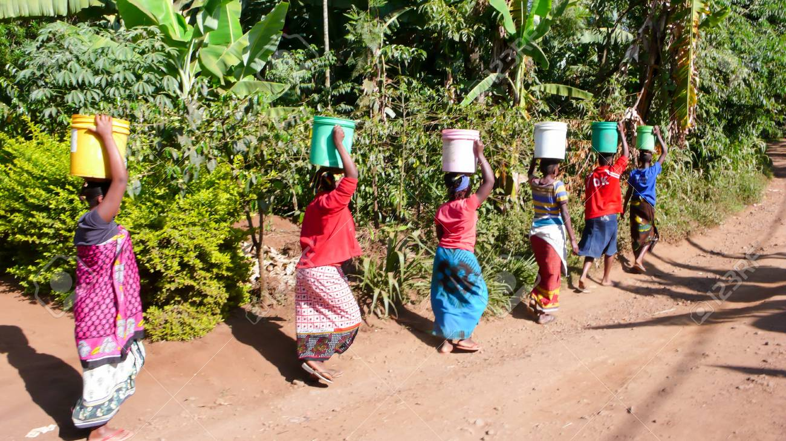
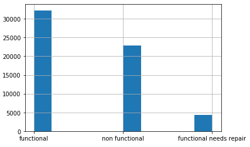

# Tanzania Water Well Predction

# Objective
The dataset consists of data on 59,400 water wells from Taarifa and the Tanzania Ministry of Water. The objective is to predict which pumps are function, which need repairs and which are non-functional. The goal is to predict one of the three classes based on the variables about the kind of pump operating, when it was installed, how it is managed and where it is located. Some knowledge of waterpoints is needed to understand the features while some are geographical. 

<b> Distribution of Target variable </b>

# Methodology

1. EDA and Preliminary Data Cleaning - This is a quick process to identify issues with the data and developed a framework to address to maximize success of analysis and reflect on ways to structure business intelligence processes down the line. 

2. Cleaning & Encoding - standardized process to make sure the same dataset is fed into different algorithims. Modular approaches to steps of cleaning make life simpler for data scientists and ensure a validity of results over multiple models. 

3. Models and results - Work on at least 3 different models and compare the results. 

# Findings 

Random Forest: 37% accuracy

XGBoost: 74.47% accuracy 

# Business Applications 

<b> Process Automation</b>
1. Automatically notify installers of broken wells at regular intervals 
2. Create a database of funders and their working wells to support fundraising process
3. Created a preferred installer list based on who has the best track record of functioning wells. 

<b> Data Science & Predictive Modelling </b>
1. At 74% accuracy on unseen data, and the top models being around 80%, this model is ready for deployment. In conjunction with the process automation listed above, it could serve to speed up repairs and identify at risk wells in real time. 
